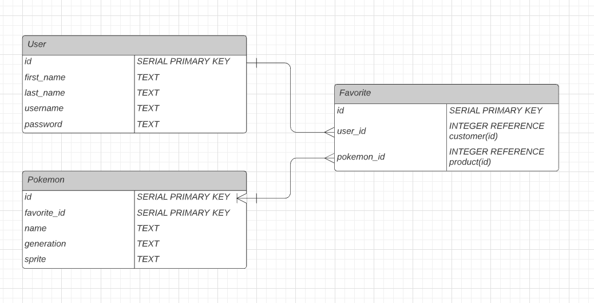

# Proposal
Requirements for the weekend

`1` An application name / concept
Pokedex with a create a Pokemon function
`2` A repo for your project 2 (built from express_auth template)

`3` Wireframe for your app - (Lucidchart)

`4` An ERD with two models (minimum) > User + 1 Resource (one to many) - (Lucidchart)

`5` Create (3-5) User Stories for the base user experience - ( [Reference](https://revelry.co/resources/development/user-stories-that-dont-suck/) )

`6` Resource's Restful Routing table ( [Readme](https://romebell.gitbook.io/sei-412/node-express/00readme-1/01intro-to-express/00readme#restful-routing) )
GET | /pokemon | Index(Read) | lists all Pokemon
GET | /pokemon/new | New(Read) | shows a form to make a new Pokemon
POST | /pokemon | Create(Create) | creates a new Pokemon with the POST data
GET | /pokemon/:id | Show(Read) | lists information about a specific Pokemon
GET | /pokemon/edit/:id | Edit(Read) | updates the data for a specific Pokemon(will try to only allow edits to custom-made Pokemon)
DELETE | /pokemon/:id | Destroy(Delete) | deletes the Pokemon with the specified id(only available for custom-made Pokemon)
GET | /pokemon/favorite | Index(Read) | lists all of user's favorite Pokemon
`7` Find API and test to see if you can get data ( *be able to print data in the console using Axios, Node-Fetch, and/or Postman* )
[Pokemon Api](https://pokeapi.co/docs/v2#pokemon-section) 